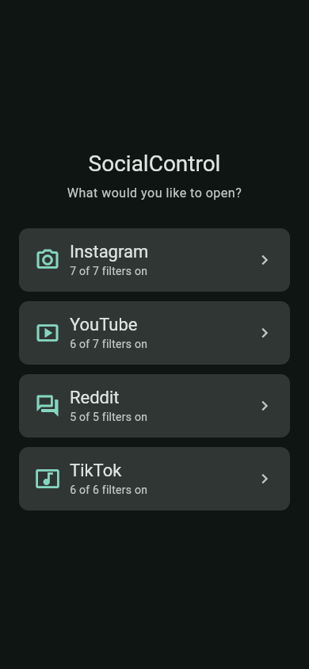

# SocialControl

Calmer social media. SocialControl shows Instagram's, YouTube's, Reddit's and
TikTok's mobile websites in filtered WebViews. When it starts, you pick which
one to open; the bar at the top switches between them.

- **Instagram**: no Reels, no Explore grid, a chronological Following feed,
  and no ads or suggested posts. Messages, stories, profiles and posting
  still work.
- **YouTube**: Subscriptions instead of the recommended Home feed, no
  Shorts, no suggested videos or autoplay, no Explore or Trending, and ads
  removed where possible. Search, channels, playlists and your library
  still work.
- **Reddit**: Home shows the communities you've joined, with no For You
  feed, no Popular, All, News or Explore, and no promoted or recommended
  posts.
  Subreddits, posts and search still work.
- **TikTok**: Home shows accounts you follow, with no For You feed, no
  Discover, LIVE, hashtag or sound feeds, and no ads. A video someone
  sends you plays on its own. Search finds accounts. Profiles, comments
  and the inbox still work.

Each site asks you to sign in first, so you only ever see your own accounts.

The filters are data in `assets/rules/` (one file per site), applied by a
script the app injects into the page, so a fix for a site change can ship
without an app release.

- [docs/DESIGN.md](docs/DESIGN.md): how it works, decisions, known limitations, roadmap
- [docs/RULES.md](docs/RULES.md): the rules format, checking rules on a device, shipping fixes

Status: MVP. Most filter rules have not yet been checked against a logged-in
session; start with the checklists in docs/RULES.md. Signing in to YouTube
inside the app works.

## Screenshots

The picker screenshot is from the local Flutter web app on this laptop and
contains no personal account data.



## Run it

You need Flutter 3.38 or later (developed with 3.47), plus the Android SDK
for Android. Android Studio installs the SDK.

```sh
flutter pub get
flutter run
```

That uses the bundled rules. To also receive rule updates, point the app at a
published copy of the rules folder:

```sh
flutter run --dart-define=RULES_BASE_URL=https://raw.githubusercontent.com/<you>/<repo>/main/assets/rules/
```

Log in with your Instagram username and password. "Continue with Facebook"
is unlikely to work, because Facebook blocks logins from embedded browsers.
Sign in to YouTube with YouTube's own Sign in button; Google's sign-in page
opens inside the app. Sign in to Reddit on its login page or with "Continue
with Google", which opens Google's sign-in over Reddit. Sign in to TikTok
with "Use phone / email / username" or "Continue with Google", which opens
Google's sign-in over TikTok. TikTok sometimes asks you to drag a slider to
fit a puzzle first.

## Run it on your phone

1. On the phone, turn on USB debugging: Settings > About phone > tap Build
   number seven times, then Settings > System > Developer options > USB
   debugging. (Menu names vary a little between phone makers.)
2. Plug the phone in and accept the "Allow USB debugging?" prompt on it.
3. Check that Flutter sees it, then run the app:

   ```sh
   flutter devices
   flutter run
   ```

   In VS Code, pick the phone in the status bar and press F5 instead.
4. Work through the checklists in [docs/RULES.md](docs/RULES.md).

Debug builds can be inspected from desktop Chrome at `chrome://inspect`, or
with `adb` and any DevTools client, to see why a rule does or doesn't match.

## Tests

```sh
flutter test                              # app logic and the bundled rules
(cd test/js && npm install && npm test)   # the injected engine, in jsdom (Node 22.22+)
```

For the local quality checks, use `make check`. It runs the Dart formatter in
check mode, `flutter analyze`, and the Flutter test suite. `make format` applies
formatting; `make lint` runs the analyzer alone.

## Releases

The latest Android build is available as [v0.2](https://github.com/william-spongberg/SocialControl/releases/tag/v0.2).

## Project layout

```
assets/rules/<site>.json      filter rules per site (data; also the files you publish)
assets/js/lite_engine.js      the engine injected into each site's pages
lib/main.dart                 startup
lib/src/site.dart             the list of sites
lib/src/rules/                rules model, route resolution, rule updates
lib/src/settings/             the user's filter choices
lib/src/webview/              engine config, URL policy, user agent
lib/src/ui/                   site picker, main screen, per-site WebView, settings
test/                         Dart tests; test/js for the engine
docs/                         design and rules guides
```

## Android emulator setup

- Download Android Studio.
- Projects > More actions > Virtual Device Manager > create a virtual device,
  then choose and download a system image.
- Projects > More actions > SDK Manager: install an SDK platform and the
  Android SDK Command-line Tools. Flutter's Gradle plugin downloads the NDK
  version it needs, so you no longer need to pin NDK 27.0.12077973 in
  `android/app/build.gradle.kts`.
- Choose the device from the bottom right of VS Code. See
  https://docs.flutter.dev/tools/vs-code
- Or plug in a physical Android device with USB debugging on.

## Notes and ideas

Remove reels, stories, etc as chosen by user. Inject JavaScript into the
webview to hide the unwanted elements. No hosting/server/etc fees (apart from
somewhere to publish the rules files, which a GitHub repo covers).

Using Flutter because it allows for easy cross-platform development.

Make open source or make it closed and profit?

The WebView is flutter_inappwebview rather than webview_flutter, because it
can inject scripts before the page's own scripts run and handles file uploads
for posting. See docs/DESIGN.md.
- https://pub.dev/packages/flutter_inappwebview
- Injecting JavaScript in a Flutter WebView:
  https://medium.com/nammaflutter/injecting-javascript-in-flutter-webview-a-complete-guide-b7a4b4286705

### User login

Idea: app accounts with sign in with Google, email and Apple.
https://pub.dev/packages/google_sign_in. The MVP has no app accounts; you log
in to each site inside its WebView.
